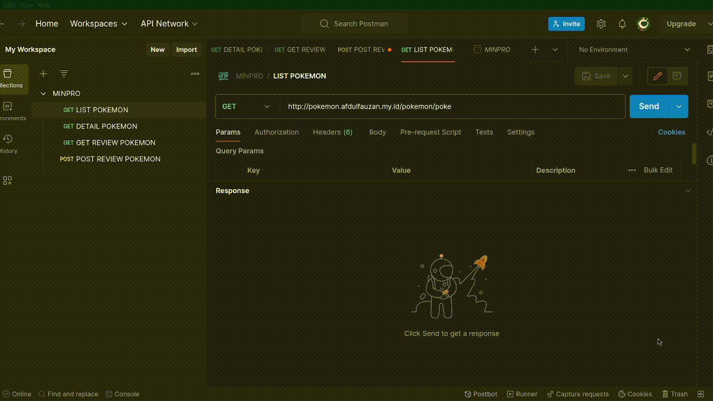
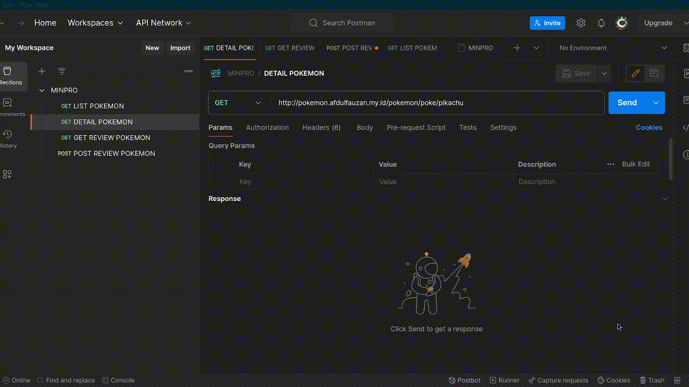
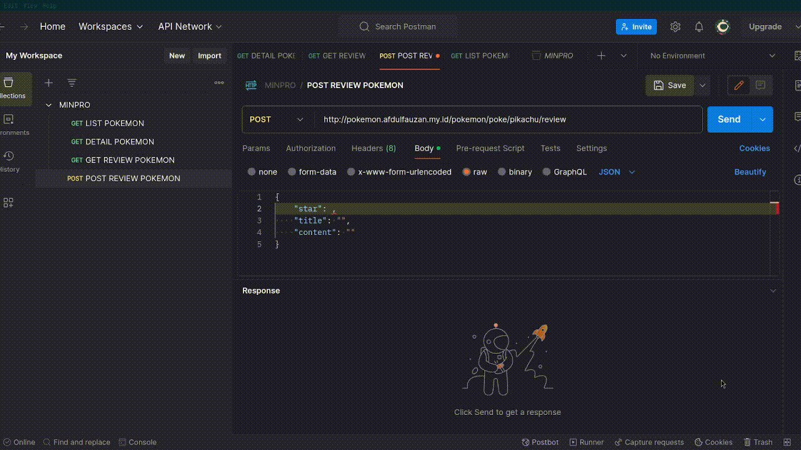
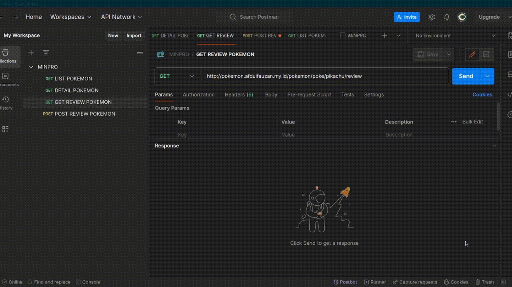

# Mini Project System Engineering

### Simple REST API Project for [pokeapi.con](https://pokeapi.co)

## Team

- Afdul Fauzan ([@afdulfauzan](https://github.com/afdulfauzan))
- Fatori Aprilian ([@fatori841](https://github.com/fatori841))

## Dependencies

- `flask`: https://flask.palletsprojects.com/en/3.0.x/
- `flask-restful`: https://flask-restful.readthedocs.io/en/latest/
- `Flask-SQLAlchemy`: https://flask-sqlalchemy.palletsprojects.com/en/3.1.x/
- `flask-migrate`: https://flask-migrate.readthedocs.io/en/latest/index.html
- `request`: https://docs.python-requests.org/en/latest/index.html
- `python-dotenv`: https://pypi.org/project/python-dotenv/
- `flask-cors`: https://flask-cors.corydolphin.com/en/latest/index.html
- `flask-sieve`: https://github.com/codingedward/flask-sieve
- `pymysql`: https://pypi.org/project/pymysql/

## Run Project Local
### Create and activate a virtual environment
```
python3 -m venv venv
```
```
source venv/bin/activate
```
### Install dependencies
```
pip install -r requirements.txt
```
### Run the project
```
python run.py
```

## Docker
### Build the image
```
docker build -t mini-project:v1.0 .
```
### Run your container 
```
docker run -d -p 5000:5000 mini-project:v1.0
```

## Testing
### Finally test that everything works by executing the following curl command
```
curl --location 'http://pokemon.afdulfauzan.my.id/pokemon/poke' \
--data ''
```
```
curl --location 'http://pokemon.afdulfauzan.my.id/pokemon/poke/charizard'
```
```
curl --location 'http://pokemon.afdulfauzan.my.id/pokemon/poke/charizard/review'
```
```
curl --location 'http://pokemon.afdulfauzan.my.id/pokemon/poke/charizard/review' \
--header 'Content-Type: application/json' \
--data '{
    "star": 5,
    "title": "oke gas",
    "content": "oke gas oke gas"
}'
```

## RESTful endpoints
| Endpoint | HTTP Method | Result |
|:---|:---:|---|
| `/pokemon/poke`  | `GET`  |  List Pokemon |
| `/pokemon/poke/{name}`  | `GET`  | Detail Pokemon  |
| `/pokemon/poke/{name}/review`  | `GET`  | Show Review Pokemon  |
| `/pokemon/poke/{name}/review`  | `POST` | Create Review Pokemon |

## DEMO REST API

REST API Endpoint

- http://pokemon.afdulfauzan.my.id

GET List Pokemon



GET Detail Pokemon



POST Review Pokemon



GET Review Pokemon


